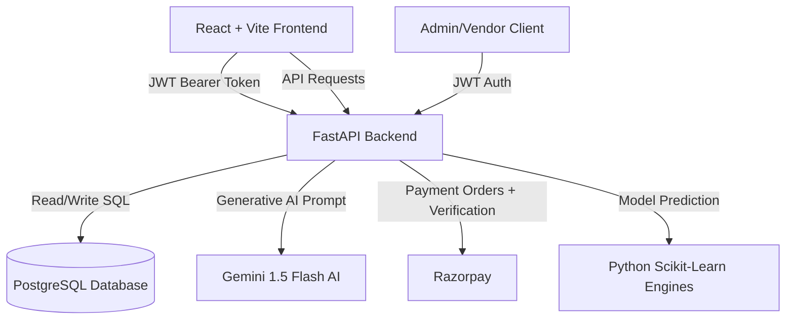

# TravelGenie 🧞‍♂️✈️
### *AI-Powered Tour & Travel Agency Operations Platform*

TravelGenie is an enterprise-grade SaaS simulation platform designed for travel agencies and tour operators. It bridges the gap between consumer trip planning and internal agency management by combining **Generative AI itinerary planning**, **predictive travel analytics**, **automated booking lifecycles**, **staff assignments**, and **PDF invoice/itinerary exports**.

---

## 🗺️ System Architecture

TravelGenie is built using a modern, decoupled client-server architecture:



### 📂 Directory Structures & Core Components

```text
├── backend/
│   ├── app/
│   │   ├── ml/                 # Machine Learning & AI Inference Modules
│   │   │   ├── ai_itinerary_generator.py # Gemini 1.5 Flash integration
│   │   │   ├── prompt_builder.py          # Structuring inputs for Gemini
│   │   │   ├── itinerary_parser.py        # Validating & parsing AI output
│   │   │   ├── cost_model.py              # ML model trainer for cost prediction
│   │   │   ├── predict_cost.py            # Estimating travel expenses
│   │   │   ├── recommendation.py          # Content-based cosine similarity recommender
│   │   │   └── sentiment.py               # Keyword sentiment extraction
│   │   ├── routes/             # FastAPI Route Routers
│   │   │   ├── admin.py                   # Analytics, Client lists, Logs
│   │   │   ├── auth.py                    # Admin JWT Login
│   │   │   ├── booking.py                 # Core Booking Lifecycle
│   │   │   ├── packages.py                # Package CRUD & Slug management
│   │   │   ├── trips.py                   # AI Generation & Trip Saves
│   │   │   └── profile.py                 # Customer settings
│   │   ├── config.py           # Centralized configuration & environment loader
│   │   ├── db.py               # Raw PostgreSQL client using psycopg2
│   │   ├── main.py             # FastAPI App bootstrap
│   │   └── responses.py        # Standardized API response formatters
│   ├── schema.sql              # Normalized database structure definitions
│   └── requirements.txt        # Backend dependencies
│
├── frontend/
│   ├── src/
│   │   ├── components/         # Reusable layouts, UI kit, charts
│   │   │   ├── ai/                        # AI Trip results, Day plans, Maps
│   │   │   ├── admin/                     # Admin tables & status actions
│   │   │   └── ui/                        # Card patterns & loaders
│   │   ├── pages/              # Primary View Containers
│   │   │   ├── admin/                     # Dashboard, Client Lists, Packages
│   │   │   ├── dashboard/                 # Bookings tracker, Payments page, Saves
│   │   │   └── public/                    # Landing Home, Booking Forms, confirmation
│   │   ├── routes/             # Protected guard systems & Lazy-loaded routes
│   │   ├── services/           # Axios HTTP request wrappers for Backend APIs
│   │   ├── hooks/useJwtAuth.js # JWT auth compatibility hook
│   │   └── App.jsx             # React entry point
│   ├── package.json            # Node dependency registry
│   └── tailwind.config.js      # Styling design system rules
```

---

## ✨ Feature Breakdown

### 1. 🤖 AI Trip Planner & Travel Assistant
* **Generative Itineraries**: Harnesses Gemini 1.5 Flash to write Maharashtra-focused trek plans including Sahyadri logistics, monsoon safety, camping guidance, and budgets in INR.
* **Smart Budget Breakdown**: Instantly calculates estimated expenses split into hotels (40%), dining (25%), transportation (20%), activities (10%), and emergency margins (5%).
* **Recommendation System**: Content-based recommendation utilizing **Cosine Similarity** (via scikit-learn CountVectorizer) to suggest alternate destinations matching the traveler's preference and region.
* **Sentiment Analysis**: Custom pipeline checks the user's travel tone (e.g., Adventure, Relaxed, Family) to dynamically alter recommendation targets.
* **Interactive UI Cards**: Renders day-by-day itineraries, custom travel tips, live-style weather projections, and Leaflet Maps pinning travel points.

### 2. 🧳 Customer Portal & Bookings
* **Trekking & Tour Catalog**: Browse structured pre-built tour packages with visual image galleries, inclusions, exclusions, difficulty levels, duration, altitude guides, and seasonal pricing.
* **Dynamic Booking Form**: Request customized trips directly from AI results or book predefined catalog treks.
* **Razorpay Payment Flow**: Pay for approved trip requests through Razorpay order creation and verified payment callbacks. Once paid, the booking transitions to the `paid` status.
* **Expedition Records**: Customer dashboard showing all bookings, saved itineraries, payment timelines, and completed trip packages.
* **PDF Invoice & Itinerary Export**: Export beautiful document layouts of invoices and custom travel plans directly from the web browser.

### 3. 📊 Enterprise Admin & Agent Dashboards
* **Operational KPI Indicators**: View live system statistics, including total bookings, revenue numbers, agent assignments, and customer retention metrics.
* **Chart.js Analytics Visualizations**:
  - *Revenue Trends*: Line chart of revenue earned across dates.
  - *Booking Statuses*: Pie chart grouping bookings by lifecycle stage.
  - *Popular Destinations*: Bar chart highlighting top travel hotspots.
* **Recent Bookings Table**: Search, filter by workflow status, assign active agents to travel tasks, add internal booking notes, and modify/approve prices.
* **Package Management Console**: Create, edit, and delete travel packages with slugs, SEO fields, custom difficulties, season descriptions, and gallery images.
* **Activity Audit Trail**: Chronological logging system tracking all action items performed by administrative users.

---

## Multi-Laptop Setup Checklist

1. Clone the repository:
   ```powershell
   git clone <repo-url>
   cd Live-Project
   ```
2. Install backend requirements:
   ```powershell
   cd backend
   python -m venv venv
   .\venv\Scripts\activate
   pip install -r requirements.txt
   pip install -U google-generativeai
   ```
3. Install frontend packages:
   ```powershell
   cd ..\frontend
   npm install
   ```
4. Create PostgreSQL DB:
   ```powershell
   createdb -U postgres travelgenie
   ```
5. Run `schema.sql`:
   ```powershell
   cd ..\backend
   psql -U postgres -d travelgenie -f schema.sql
   ```
6. Create `backend/.env` with DB, JWT, admin, Gemini, and Razorpay values:
   ```properties
   DB_HOST=localhost
   DB_NAME=travelgenie
   DB_USER=postgres
   DB_PASSWORD=your_postgres_password
   DB_PORT=5432
   JWT_SECRET_KEY=generate_a_random_customer_jwt_key
   GEMINI_API_KEY=your_gemini_api_key_here
   GEMINI_MODEL=gemini-1.5-flash
   ADMIN_SECRET_KEY=generate_a_random_jwt_key
   ADMIN_USERNAME=admin
   ADMIN_PASSWORD=secure_admin_password
   RAZORPAY_KEY_ID=your_razorpay_key_id
   RAZORPAY_KEY_SECRET=your_razorpay_key_secret
   ```
7. Create `frontend/.env`:
   ```properties
   VITE_API_BASE_URL=http://localhost:8000/api
   VITE_RAZORPAY_KEY_ID=your_razorpay_key_id
   ```
8. Start backend:
   ```powershell
   cd backend
   .\venv\Scripts\activate
   python -m uvicorn app.main:app --reload
   ```
9. Start frontend:
   ```powershell
   cd frontend
   npm run dev
   ```

Protected local files: `.env`, `node_modules`, `venv`, `dist`, and `__pycache__` are ignored by git.

## 🛠️ Local Setup Instructions

### Backend Setup
1. **Navigate to the backend directory and set up a virtual environment**:
   ```powershell
   cd backend
   python -m venv venv
   .\venv\Scripts\activate
   ```
2. **Install all required libraries**:
   ```powershell
   pip install -r requirements.txt
   ```
3. **Configure Environment Variables**:
   Copy `.env.example` to `.env` and fill in the values:
   ```properties
   DB_HOST=localhost
   DB_NAME=travelgenie
   DB_USER=postgres
   DB_PASSWORD=your_postgres_password
   DB_PORT=5432
   JWT_SECRET_KEY=generate_a_random_customer_jwt_key
   GEMINI_API_KEY=your_gemini_api_key_here
   ADMIN_SECRET_KEY=generate_a_random_jwt_key
   ADMIN_USERNAME=admin
   ADMIN_PASSWORD=secure_admin_password
   RAZORPAY_KEY_ID=your_razorpay_key_id
   RAZORPAY_KEY_SECRET=your_razorpay_key_secret
   ```
4. **Initialize Database Tables**:
   Ensure PostgreSQL is running locally, create a database named `travelgenie`, and run:
   ```powershell
   psql -U postgres -d travelgenie -f schema.sql
   ```
5. **Run the Uvicorn Dev Server**:
   ```powershell
   python -m uvicorn app.main:app --reload
   ```
   *The backend will be running at `http://127.0.0.1:8000`.*

### Frontend Setup
1. **Navigate to the frontend directory**:
   ```powershell
   cd ../frontend
   ```
2. **Install Node packages**:
   ```powershell
   npm install
   ```
3. **Configure Environment Variables**:
   Create a `.env` file in the frontend folder:
   ```properties
   VITE_API_BASE_URL=http://localhost:8000/api
   VITE_RAZORPAY_KEY_ID=your_razorpay_key_id
   ```
4. **Launch Vite Dev Server**:
   ```powershell
   npm run dev
   ```
   *The client web application will be available at `http://localhost:5173`.*

---

## 🔍 Technical Critique & Anti-Patterns

While TravelGenie features a robust interface and comprehensive flows, a deep-dive analysis of the codebase reveals several critical anti-patterns, performance bottlenecks, and architectural limitations:

### 1. Database Connection Pooling
`backend/app/db.py` now uses a `ThreadedConnectionPool` and returns request connections to the pool on close.
* **Production note**: Keep pool sizing aligned with Render/Railway PostgreSQL connection limits.

### 2. Schema Safety
Runtime schema mutation has been removed from request paths. Startup now uses `information_schema.columns` to report missing columns and relies on `schema.sql` as the database source of truth.
* **Remaining production recommendation**: Introduce Alembic or another versioned migration tool before multi-environment deployment.

### 3. Schema Consistency
`backend/schema.sql` is the authoritative schema. Runtime schema mutation has been removed from request paths, while production migrations keep existing databases aligned.

### 4. ML Cost Prediction Logic Flaw (Alphabetical Bias)
In `cost_model.py`, a `LinearRegression` model is trained using a label-encoded `City` column as the single feature ($X$ variable):
```python
le_city = LabelEncoder()
df["City"] = le_city.fit_transform(df["City"])
X = df[["City"]]
y = df["Cost"]
```
* **Impact**: In linear regression, integer labels are evaluated numerically. This implies that cities alphabetically ordered later are treated as having a larger numerical input value, leading the model to assume their pricing scales linearly purely based on their spelling index.
* **Solution**: Avoid regression on raw label-encoded categories. Categorical destinations should be **One-Hot Encoded** if used in regression, or simply retrieved using a basic lookup map of historical city average costs.

### 5. Dict-Based Sentiment & Recommendation Fallbacks
* The travel sentiment module (`sentiment.py`) does not use NLP classifiers or models. It searches text strings for hardcoded word lists (e.g., searching for "beach" or "nightlife" to flag a trip as "Positive").
* Recommendation system fallbacks in `recommendation.py` contain hardcoded arrays of popular locations (like Manali Temple paths or Goa beaches) when a keyword search is failed.

### 6. Admin JWT Authentication
Admin login uses bcrypt-hashed credentials stored in the `admins` table, with environment credentials acting as a development recovery path that refreshes the stored hash.

---

## 🚀 Production Roadmap & Future Enhancements

To take TravelGenie from a local simulation to a production-ready SaaS product, the following updates are recommended:

* [ ] **Migrate to Alembic**: Introduce version-controlled schema migrations to ensure seamless, repeatable database modifications without executing dynamic DDL queries.
* [ ] **Add Razorpay Webhooks**: Extend the current Razorpay order/signature flow with webhook-based reconciliation for production dispute and settlement tracking.
* [ ] **Upgrade ML Architectures**:
  - Replace the regression estimator with a Random Forest or Gradient Boosting model utilizing true parameters (seasonality indices, traveler volume, hotel tier).
  - Adopt NLTK VADER or a lightweight HuggingFace transformer model to perform genuine semantic analysis of client preferences.
* [ ] **Expand Multi-User Admin Auth**: Add admin user management screens and optional staff-level permissions on top of the existing bcrypt-backed admin table.
* [ ] **Cloud Media Hosting**: Integrate AWS S3 or Cloudinary APIs to upload, optimize, and serve tour package images and customer invoices.
* [ ] **Automated Testing Suite**: Introduce unit testing for FastAPI endpoints (using `pytest` and `httpx`) and end-to-end frontend pipeline checks (using Playwright).
* [ ] **Live Customer-Agent WebSockets Chat**: Allow customers to chat in real-time with their assigned agency representative using WebSocket channels.
