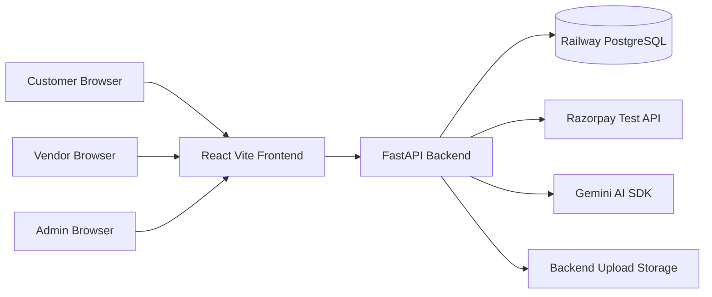
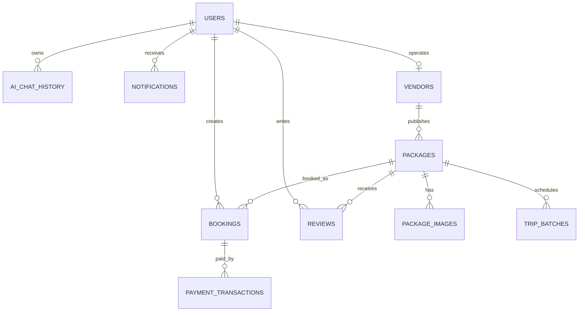
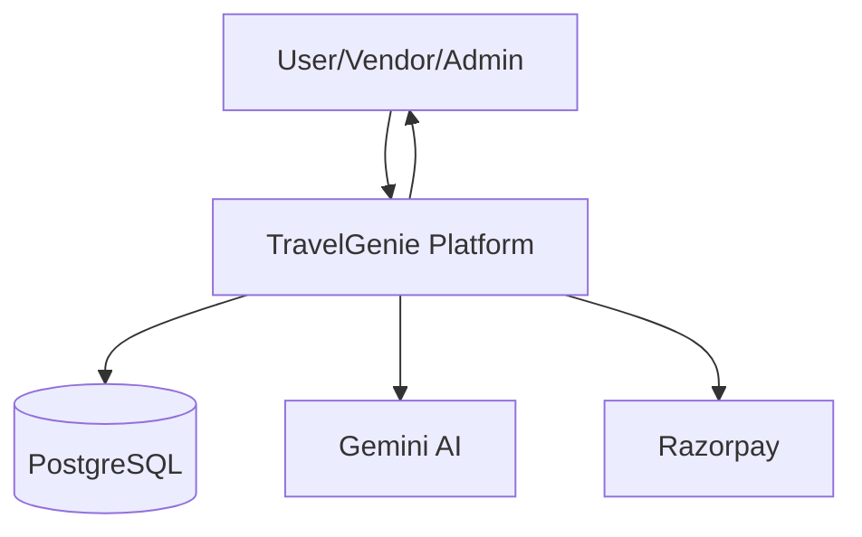
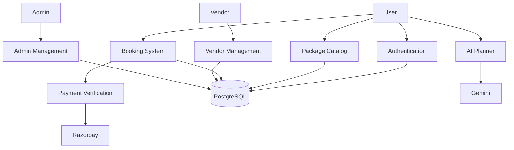
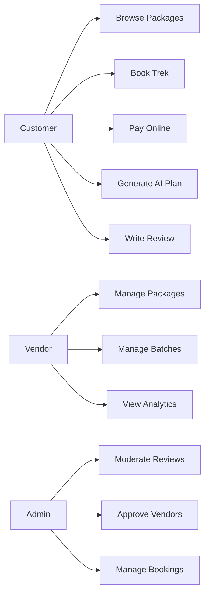
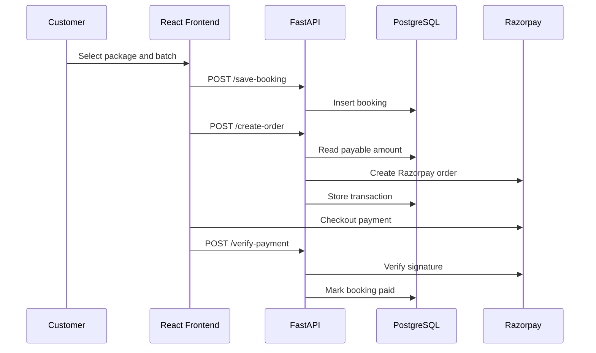
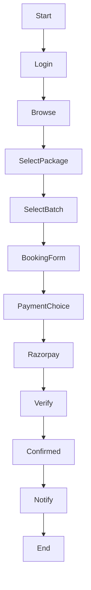
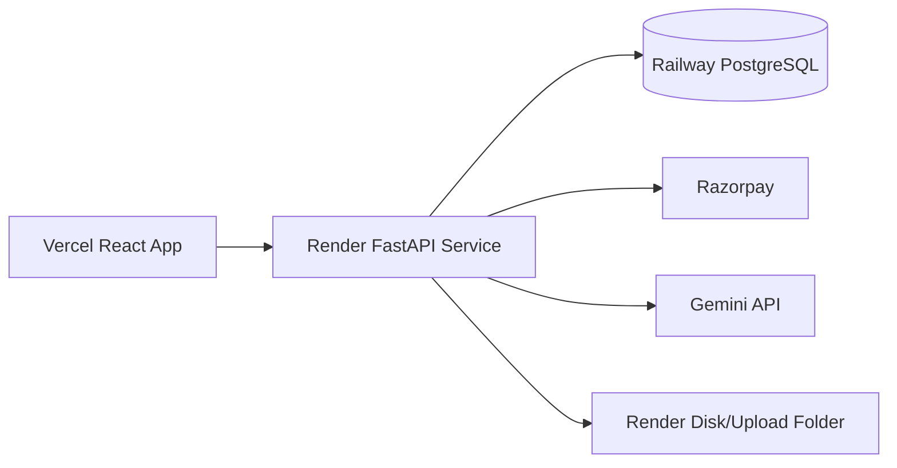
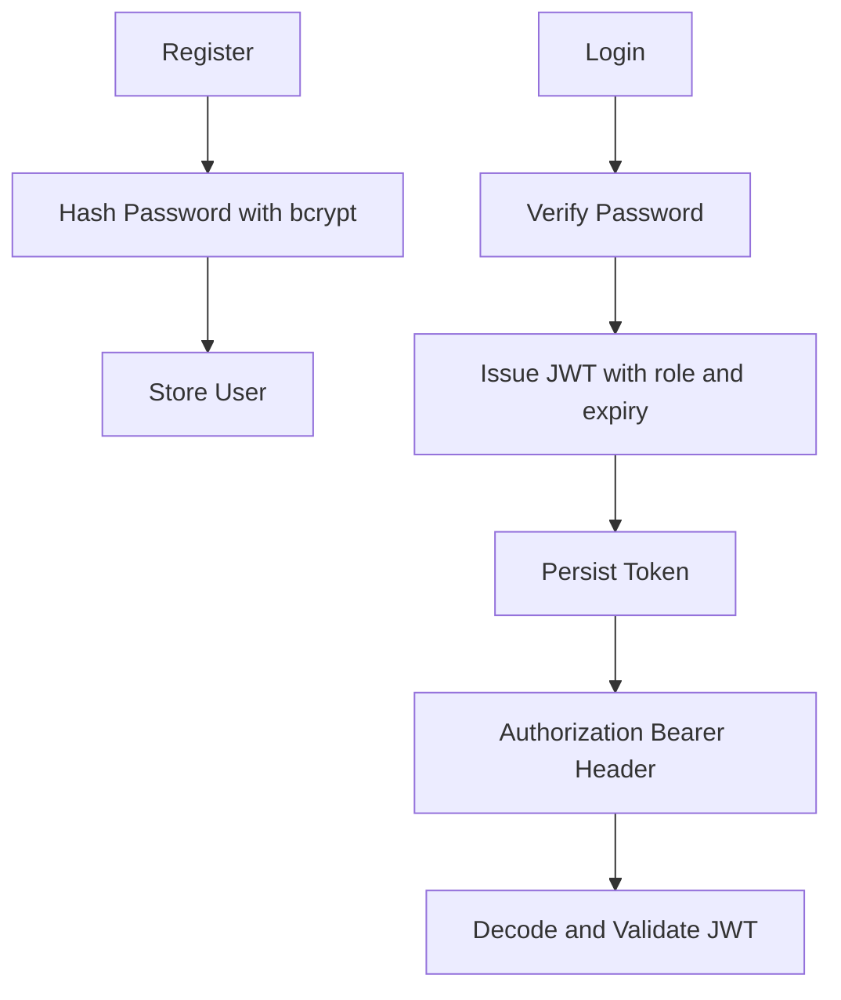
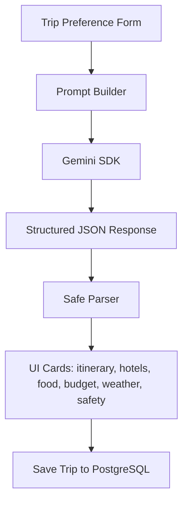

# TravelGenie: AI Powered Maharashtra Travel & Trekking SaaS Platform

## Abstract

TravelGenie is a production-oriented SaaS MVP for Maharashtra travel, trekking, camping, fort trails, and AI-assisted itinerary planning. The platform combines a React frontend, FastAPI backend, PostgreSQL database, JWT authentication, Razorpay payments, and Gemini-powered AI planning to provide a realistic marketplace experience for customers, vendors, and administrators.

The system supports dynamic package discovery, package details, trip batches, booking workflows, payment verification, vendor onboarding, admin moderation, reviews, notifications, analytics, and structured AI travel plans. It is designed for deployment using Vercel, Render, and Railway PostgreSQL.

## Introduction

Tourism platforms often focus on generic hotel and destination listings. Maharashtra trekking requires more specialized handling: trail difficulty, pickup points, batch dates, weather risk, monsoon safety, local operators, guide coordination, seat availability, and verified payment flow. TravelGenie addresses this gap through a data-driven marketplace supported by AI itinerary generation.

## Literature Survey

Existing travel systems such as MakeMyTrip, Tripoto, Thrillophilia, and trekking operator websites provide inspiration for package discovery, itinerary presentation, reviews, and booking flows. However, most general-purpose travel systems do not combine localized Maharashtra trekking data, vendor dashboards, trip batches, payment tracking, and AI-generated structured plans in one student-built full-stack platform.

## Existing System

Traditional trekking operations are often managed through WhatsApp groups, spreadsheets, manual payment confirmation, and static social media posts. Limitations include weak seat tracking, unclear cancellation/payment state, lack of centralized reviews, no structured AI planning, and limited analytics for vendors and administrators.

## Proposed System

TravelGenie proposes a centralized SaaS platform with:

- Customer package discovery, booking, AI planning, reviews, and notifications.
- Vendor package, batch, booking, and analytics management.
- Admin controls for packages, vendors, bookings, clients, reviews, and platform analytics.
- PostgreSQL-backed dynamic data instead of static frontend content.
- Razorpay test payment flow with order creation, verification, failure tracking, and duplicate protection.
- Gemini AI planner returning structured JSON rendered into clean UI cards.

## Objectives

- Build a realistic AI travel SaaS MVP.
- Provide Maharashtra-specific trekking and camping package management.
- Implement JWT authentication and role-based access.
- Store all operational data in PostgreSQL.
- Support payment and booking lifecycle tracking.
- Generate structured AI itineraries for travel planning.
- Prepare deployment for Vercel, Render, and Railway.

## Scope

The system covers Maharashtra trekking, camping, fort trails, coastal trips, and AI itinerary planning. It includes user, vendor, and admin workflows. Future integrations may include live weather APIs, geospatial maps, SMS/WhatsApp reminders, and production Razorpay accounts.

## Technologies Used

- Frontend: React, Vite, TailwindCSS, React Router, Axios/fetch services.
- Backend: FastAPI, Pydantic, psycopg2, JWT, Passlib bcrypt.
- Database: PostgreSQL with normalized core tables and JSONB fields for flexible package metadata.
- Payments: Razorpay SDK.
- AI: Gemini SDK.
- Deployment: Vercel frontend, Render backend, Railway PostgreSQL.

## Requirement Analysis

Functional requirements:

- Register/login users with JWT.
- Browse and book packages.
- Generate AI itineraries.
- Create Razorpay orders and verify payments.
- Manage vendors, packages, reviews, and bookings.
- Seed a realistic PostgreSQL ecosystem.

Non-functional requirements:

- Secure password hashing.
- Role-based protected routes.
- Production CORS configuration.
- Clean API validation and error responses.
- Responsive frontend.
- Scalable seed and migration workflow.

## Feasibility Study

Technical feasibility is high because the platform uses stable open-source frameworks and managed deployment targets. Operational feasibility is strong because travel vendors already work with package, batch, and booking workflows. Economic feasibility is suitable for an MCA major project and a SaaS MVP because external services are usable in free or test tiers during development.

## System Architecture

## Database Design

Core tables:

- `users`: customers, vendors, admins by role.
- `admins`: admin credential recovery table.
- `vendors`: marketplace operator profiles.
- `packages`: package catalog with rich trek metadata.
- `package_images`: package image references.
- `trip_batches`: available departures and seat tracking.
- `bookings`: customer booking lifecycle.
- `payment_transactions`: Razorpay order/payment history.
- `reviews`: package and vendor reviews.
- `notifications`: user and vendor alerts.
- `ai_chat_history`: AI prompts and responses.
- `activity_logs`: audit and analytics support.

## ER Diagram

## DFD Level 0

## DFD Level 1

## Use Case Diagram

## Sequence Diagram

## Activity Diagram

## Deployment Diagram

## Module Explanation

Authentication module handles JWT login, registration, token validation, role checks, and bcrypt password hashing. Package module exposes package CRUD, package detail, trip batches, and image metadata. Booking module validates booking input, stores booking requests, and updates seat counts. Payment module creates Razorpay orders from server-side booking totals and verifies signatures. Vendor module handles registration, package creation, batch management, and analytics. Admin module handles dashboard metrics, booking review, vendor approval, and moderation. AI module builds Gemini prompts and parses structured JSON responses.

## API Architecture

The backend exposes RESTful routes under `/api`. Public routes include package listing and package details. Protected customer routes include bookings, AI history, profile, and reviews. Vendor and admin routes use role-based JWT checks. API errors are returned in a consistent JSON shape with `success`, `message`, and `detail`.

## JWT Authentication Flow

## Razorpay Flow

The client requests an order using a booking ID. The backend reads the booking amount from PostgreSQL, creates a Razorpay order, and stores a `payment_transactions` row. After checkout, the client submits Razorpay IDs and signature. The backend verifies the signature using the Razorpay SDK, marks the booking as paid, and records the payment ID. Failed payments are tracked through a dedicated route.

## AI Planner Workflow

## Frontend Architecture

The frontend uses React route splitting, service modules, reusable UI components, dashboard layouts, and TailwindCSS styling. API calls are centralized through service utilities. Heavy libraries such as PDF generation, charts, maps, and canvas rendering are chunked for production builds.

## Backend Architecture

The backend is organized into route modules, auth utilities, AI modules, services, configuration, database pooling, and seed scripts. PostgreSQL is accessed through psycopg2 with connection pooling. Startup checks validate required tables and configuration.

## PostgreSQL Design

PostgreSQL uses relational integrity for users, vendors, packages, batches, bookings, payments, and reviews. JSONB is used for flexible package metadata such as itinerary, gallery, weather details, FAQs, highlights, transport information, and safety notes. Indexes support common dashboard and package queries.

## Implementation Details

Important implementation details include:

- `schema.sql` as authoritative baseline.
- `migrations/20260527_production_stabilization.sql` for production stabilization.
- `scripts/master_seed.py` for full ecosystem generation.
- `/uploads` static mount for backend-served package images.
- `/api/uploads/package-image` for validated image uploads.
- Gemini prompt builder enforcing Maharashtra-only itinerary generation.

## Testing

Testing includes:

- Python syntax checks using `python -m compileall -q backend\app backend\scripts`.
- Frontend production build using `npm run build`.
- Frontend lint validation using `npm.cmd run lint`.
- API route validation through Pydantic request models.
- Database compatibility through schema and migration application.
- Manual scenario testing for login, package browsing, booking, payment, reviews, and admin dashboards.
- FastAPI TestClient smoke testing for customer, vendor, admin, upload, package, itinerary, and Razorpay idempotency flows.

## Validation

Validation exists at multiple layers:

- Frontend forms validate required user input.
- Pydantic validates backend request payloads.
- Booking routes validate batch capacity and user ownership.
- Payment routes validate booking ownership and duplicate payment prevention.
- Upload route validates content type and file size.

## Outputs

Expected platform outputs include:

- Populated package catalog.
- Detailed package pages with gallery, batches, weather, FAQ, reviews, and safety notes.
- Customer dashboard with real bookings and AI history.
- Vendor dashboard with package and booking analytics.
- Admin dashboard with platform metrics.
- Structured AI trip results.
- Professional AI trip planner UI with summary, maps, hotels, restaurants, itinerary timeline, budget, safety, packing, transport, and nearby attraction sections.
- Live OpenStreetMap/Leaflet maps on AI, package, and booking detail views.
- Razorpay transaction records.

## Final Product Polish and Stabilization

The final product polish phase focused on making TravelGenie feel like a real AI travel SaaS platform rather than a basic CRUD demonstration. The AI planner was refined from a chat-like response surface into a structured trip planning interface. The result page now presents a hero trip summary, estimated budget, travel mood, live destination map, day-wise itinerary cards, hotel and restaurant recommendations, budget distribution, packing checklist, safety guidance, nearby attractions, and transport recommendations. The UI avoids raw markdown and renders travel data as compact, scannable widgets.

The map layer was upgraded to a reusable Leaflet/OpenStreetMap component. It resolves known Maharashtra trekking destinations such as Rajmachi, Kalsubai, Harishchandragad, Lohagad, Tikona, Pawna, Bhandardara, Andharban, Torna, Sinhagad, Alibaug, Dapoli, and Malshej into real map coordinates. Package detail pages, booking detail pages, and AI trip results now use the same live map system. Pickup points and nearby attractions are also visualized as markers when available from PostgreSQL-backed package data.

The booking detail experience was improved with a live location map and stronger payment-state handling. Payment creation remains server-authoritative: the frontend sends only the booking ID, while the backend reads ownership and payable amount from PostgreSQL. This prevents tampering and keeps the payment amount consistent with the approved booking.

The admin booking table was polished into a more professional SaaS operations interface. Instead of showing too many action buttons at once, the table now shows the primary review action and moves secondary transitions such as approve, request payment, mark paid, complete, reject, and cancel into a compact contextual action menu. Status pills remain visible for quick scanning.

## Major Issues Faced and Fixes

1. Firebase to JWT migration drift: Early project versions used Firebase authentication, while the final system uses JWT and PostgreSQL. Leftover Firebase references caused import and documentation mismatch risks. The final system removed active Firebase dependencies, added a JWT compatibility hook on the frontend, and normalized tokens to always expose `id`, `uid`, `email`, and `role`.

2. Admin identity mismatch: Admin JWTs originally used the username as the token subject and did not include a numeric `uid`. This could conflict with backend routes that expect a database user identifier. The final admin token now includes `id`, `uid`, `email`, `username`, and `role`, and token verification rejects role-like identities such as `admin`, `vendor`, or `customer`.

3. PostgreSQL schema drift: The project had legacy differences around Firebase user IDs, payment tables, saved itineraries, package metadata, and JSON fields. `schema.sql` is now authoritative, production stabilization migrations align older databases, and master seed validates the full schema.

4. Razorpay duplicate order risk: Repeated frontend retries could create duplicate payment orders or conflict with unique Razorpay order indexes. The backend now locks the booking row, reuses existing active payment orders, stores payment retry metadata, handles duplicate verification callbacks safely, and enforces one active payment order per booking.

5. AI output rendering quality: Raw or inconsistent AI response structures can make the planner look unprofessional. The frontend now renders safe structured sections and supports richer nested activity fields including timing, transport, food, and stay information.

6. Map realism: Earlier map surfaces could appear fake or static. The final system uses live Leaflet maps and Maharashtra trek coordinate matching for package, booking, and AI planner pages.

7. Upload stability: Package image uploads require multipart parsing, file validation, SVG support, size limits, static serving, and URL consistency. The upload route validates MIME type and file size, stores package images under the configured upload directory, and serves them through `/uploads`.

## Final QA Evidence

The final QA process verified:

- Master seed successfully applies schema/migrations, truncates safely, resets sequences, creates vendors, users, packages, package images, trip batches, bookings, payments, reviews, notifications, AI history, saved itineraries, analytics, and activity logs.
- Customer login, `/auth/me`, package list, package detail, package batches, bookings, profile, AI saved trips, and booking creation return HTTP 200.
- Vendor login, vendor profile, package list, batches, booking view, analytics, and SVG upload return HTTP 200.
- Admin login, stats, clients, vendors, and review moderation APIs return HTTP 200.
- Razorpay idempotency test confirms duplicate order creation reuses the first order, Razorpay create is called once, verification marks the booking paid, and no active pending order remains.
- Frontend lint and production build pass.
- Backend compile and health check pass.

## Screenshots Placeholders

- Home page.
- Customer dashboard.
- Package listing.
- Package detail with batches.
- Booking form.
- Razorpay checkout test screen.
- AI itinerary result.
- Vendor dashboard.
- Admin dashboard.
- PostgreSQL seeded tables.

## Future Scope

- Live weather API integration.
- WhatsApp/SMS booking reminders.
- Advanced route overlays and live traffic-aware travel estimates.
- Refund and cancellation workflow.
- Advanced recommendation engine.
- Vendor subscription billing.
- Mobile app using React Native.
- Cloud object storage for uploaded images.

## Conclusion

TravelGenie demonstrates a realistic full-stack SaaS platform for Maharashtra travel and trekking. It integrates PostgreSQL-backed marketplace data, JWT authentication, Gemini AI itinerary generation, Razorpay payments, vendor workflows, admin controls, and production deployment readiness. The project moves beyond CRUD functionality and presents an industry-style MVP suitable for an MCA major project.

## Bibliography

- FastAPI Documentation.
- PostgreSQL Documentation.
- React Documentation.
- Vite Documentation.
- Razorpay API Documentation.
- Google Gemini API Documentation.
- OWASP Authentication and Password Storage Guidelines.
